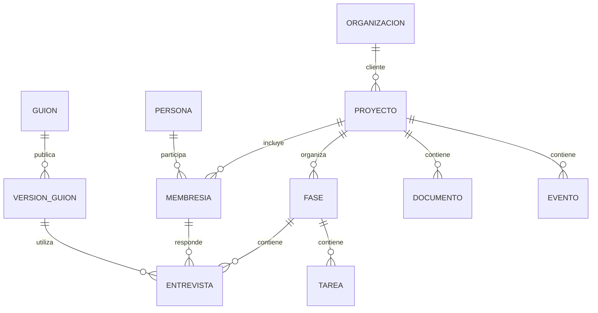

# Diagnóstico y roadmap del portal administrativo

Fecha: 19 de septiembre de 2026.

## Alcance y conclusión

Revisión estática de las cuatro pantallas del admin, sus formularios, acciones del servidor, servicios de consultoría, migraciones y pruebas del repositorio. Se revisó el árbol de trabajo mientras Cursor continuaba la estabilización; HEAD observado durante la revisión: `41b31ea97b739067fe5b130b725903d7c6f9bf92`. Las referencias describen el código local, no certifican lo desplegado. No se accedió a datos reales, no se iniciaron sesiones como participantes, no se enviaron invitaciones y no se ejecutaron acciones administrativas. Este documento es el único archivo creado para el diagnóstico.

El admin tiene una base reutilizable, pero su estructura refleja la incorporación sucesiva de funcionalidades. La edición incompleta tiene tres causas: faltan operaciones, las entidades están mezcladas y algunas escrituras contradicen lo que promete la interfaz. Un cambio de apariencia por sí solo no lo resuelve.

Conviene conservar Next.js, Supabase, los componentes de formulario y las protecciones transaccionales del flujo de entrevistas. El trabajo principal es completar los procesos administrativos y corregir relaciones, estados y responsabilidades. No se propone una reescritura total ni un cambio de framework.

**Confirmado** significa observable en el código. **Riesgo** significa una consecuencia posible que requiere una prueba específica; no implica que ya haya ocurrido en producción. **Propuesta** es una decisión de producto o implementación todavía no aprobada.

## Recordatorio al volver del descanso — 20 de septiembre de 2026

**Primero recordar al usuario:** reportó que desde el chat, al menos en móvil, no encuentra cómo terminar un tema/sección anticipadamente. Quiere que el participante pueda hacerlo aunque el agente no haya ofrecido cierre, con advertencia y confirmación para no sentirse atrapado. Es una decisión de producto confirmada; implementación y disponibilidad actuales por verificar. No cambiar el estado global de una fase del proyecto: la acción corresponde al tema/sección de su entrevista.

- Ofrecer una salida secundaria visible y accesible incluso sin oferta del modelo: “Terminar este tema antes de tiempo”. No condicionarla al botón de cierre normal.
- Advertir que pueden quedar preguntas sin responder, permitir seguir respondiendo o confirmar el cierre anticipado, y conservar las protecciones del borrador, permisos, síntesis e idempotencia. No convertir un error de cierre normal en cierre forzado automáticamente.
- En el último tema, explicar explícitamente si confirmar también entrega la entrevista y solicita el correo. No entregar al abrir una página ni antes de la confirmación.
- Comprobar móvil y escritorio. Esto no es un bypass de autorización ni un cambio global de fase.

**Otro pendiente inmediato:** login de `portal-participante` muestra directamente “Listo para enviar”. La cuenta tiene varias entrevistas QA; verificar qué entrevista selecciona el landing y su estado antes de atribuirlo al cierre nuevo. No modificar, finalizar ni borrar datos para ocultar el caso.

Última publicación reportada: `6eab421c2806dc7fe1f68c81960346e33ac57ae2`, deployment `dpl_b3asHAtpWACVmFatHYbxFEJiD3uG`. Las referencias posteriores conservan el historial de planificación y pueden ser anteriores a esa publicación. Durante el descanso no se solicita iniciar implementación, envíos ni despliegues.

## Prioridad vigente y punto de retorno — 20 de septiembre de 2026

Acuerdo más reciente del usuario: concentrar el trabajo previo al piloto en **rendimiento y experiencia de entrevista**. Admin funcional, rediseño del admin y WhatsApp quedan pausados; las secciones posteriores conservan el backlog, no definen la prioridad inmediata.

Orden acordado:
1. Retomar el reporte de Cursor recibido sobre `7e2f3cf`: audio y protección del borrador implementados en un commit separado del visual aprobado `bd86be9`. Pruebas sintéticas reportadas. **Audio y transcripción reales validados el 20 de septiembre de 2026; no repetir.** No rehacer ese trabajo.
2. Completar y revisar la experiencia: audio, transcripción editable, conservación de borradores, guardado, pausa/regreso y cierre claro. Cliente conserva portal y onboarding; stakeholder entra directamente a entrevista sin onboarding del portal.
3. Cerrar rendimiento acotado al piloto: validar el candidato de consultas, verificar las regiones efectivas y medir el primer texto del chat. Priorizar cambios con evidencia, sin otra investigación indefinida ni cambios de autenticación sin validación.
4. Preparar una versión integrada explícita y probar ese candidato: roles, móvil, audio real, recuperación de fallos y entrevista completa. No mezclar automáticamente ramas pendientes. Publicación sujeta a validación y autorización; esta nota no autoriza deploy.
5. Lanzar el piloto en etapas: primeras 3 personas observadas, corregir bloqueos y continuar con las otras 12. La observación y ajuste son parte del piloto, no un requisito que pueda completarse antes de iniciarlo.

Condición de entrada: flujo claro, respuestas protegidas, audio funcionando y esperas medidas y aceptables. No es necesario completar todo el roadmap del admin para iniciar el piloto. El piloto se había previsto para la semana del 21 de septiembre; fecha exacta pendiente de confirmar.

Últimas referencias reportadas (no verificadas de nuevo con remoto en esta anotación):
- Producción: `8bed18d`.
- Piloto confirmado el 20 de septiembre de 2026: rama `piloto/entrevista-esfuerzo`, SHA `7e2f3cf643b15b26091c05ae8accf27cd0488bed`, worktree `/Users/salbagli/Projects/consulting-piloto-entrevista`; diseño aprobado en `bd86be9`, audio y protección del borrador en `7e2f3cf`. Sin push ni deploy. En ese worktree hay cambios locales de instrumentación de prueba (rutas `/vista-previa-entrevista/microfono` y `/transcribir`); no forman parte del SHA ni del candidato integrado.
- Rendimiento: `2d56e42b642048c5ad73e2e056a00e84343739a0`, rama `perf/fase-entrevista-load`, worktree `/Users/salbagli/Projects/consulting-perf-fase`. Consultas optimizadas, sin región en el candidato, sin publicar; medición real comparable pendiente.
- Admin: `5ff3a69`, rama `admin/portal-edicion`, worktree `/Users/salbagli/Projects/consulting-admin-portal`. Demo aprobada funcionalmente; integración real pendiente; sin publicar. No incorporar al candidato del piloto.
- Conservar la carpeta habitual y sus cambios pendientes. No asumir que las demos o servidores locales siguen encendidos.

### Último reporte de Cursor: audio y borrador (`7e2f3cf`)

- Demo reportada: `http://127.0.0.1:3103/vista-previa-entrevista`, siempre sintética. Variantes `?voz=denegado`, `?voz=sin-mic`, `?voz=fallo`. No usa `getUserMedia`, Whisper ni modelo; onda sintética y transcripción fija. No abrirla esperando una solicitud de permiso real.
- Producto: borrador asociado a entrevista/sección. Cambiar de tema con texto pendiente ofrece seguir editando, enviar al tema actual o descartar y continuar; no arrastra el borrador al siguiente tema.
- Producto: grabación con duración, cancelar toma, detener/transcribir, resultado editable concatenado al borrador sin envío automático; errores accesibles y liberación de micrófono/AudioContext al terminar o salir, según reporte.
- Pruebas reportadas: tres salidas del diálogo de borrador; grabar/cancelar; transcripción simulada editable; permiso denegado, ausencia de micrófono y fallo conservando texto; unitarias de helpers. No se aportó todavía una lista completa de controles finales sobre este SHA.
- Validado el 20 de septiembre de 2026 (no repetir): micrófono real (permiso, onda reactiva, duración, cancelar/detener y apagado de pistas) y transcripción real vía `/api/transcribe`, con texto editable concatenado al borrador y sin envío automático de la respuesta. La demo sintética de `/vista-previa-entrevista` sigue siendo solo simulación; no sustituye esa validación.
- Sigue pendiente sobre el producto: kickoff con modelo real, recorrido autenticado de entrevista completa, móvil, y medición comparable de primer texto del chat. La instrumentación temporal de las rutas de prueba no se incorpora al candidato integrado.

**Candidato integrado (20 de septiembre de 2026):** rama `piloto/candidato-integrado`, SHA `b982c0faf2382425d76e937e9b2a04d0d01de89a`, worktree `/Users/salbagli/Projects/consulting-piloto-integrado`. Base piloto `7e2f3cf` + cherry-pick de consultas `2d56e42` (auto-merge en `lib/consultoria/entrevistas.ts`, se conservan `entrevistaParaReintentoCorreo` y las lecturas de portal). No incluye admin `5ff3a69`, ni las rutas temporales `/microfono` y `/transcribir`, ni fra1. Sin push ni deploy.

## 1. Inventario de entidades y operaciones actuales

| Entidad | Qué existe | Qué falta o está limitado | Objetivo de producto |
| --- | --- | --- | --- |
| Cliente / organización | Agrupación por texto `proyecto.cliente` | No es una entidad con identidad y ficha; variaciones de texto crean grupos distintos | Organización reutilizable, relacionada con proyectos y personas |
| Proyecto | Crear, listar y abrir | No hay acción de editar nombre/cliente, archivar, restaurar o configurar responsables | Ficha editable, estado y ciclo de vida explícitos |
| Fase | Crear, editar nombre/descripción/fechas y cambiar estado | Sin reordenamiento, archivo ni revisión del impacto al completar; orden asignado con lectura seguida de inserción | Edición completa, orden consistente y transiciones explícitas |
| Persona / stakeholder | Crear, editar datos, cambiar acceso, entrar como persona | Vinculada a un solo proyecto; email único global; alta acoplada a invitación; sin archivo ni membresías | Identidad estable separada de participación en proyectos y acceso |
| Cuenta y permisos | Rol en `usuario`, vínculo indirecto por email | Sin gestión dedicada de invitaciones, revocación o rol por proyecto | Cuenta opcional vinculada por ID; permisos de proyecto explícitos |
| Firma / empresa | Texto en cada persona | Sin catálogo, renombrado centralizado o relación estable | Organización, con rol de cliente o firma dentro de cada relación |
| Plantilla / guion | Crear, editar secciones y enviar a destinatarios | Sin renombrado, duplicado, archivo, historial/versiones ni publicación diferenciada | Borrador, versión publicada, vista previa y asignaciones trazables |
| Entrevista asignada | Crear desde plantilla, consultar, editar guion antes de empezar, editar JSON y descargar | Sin ruta propia por ID; ficha de persona toma una sola; falta cancelación y revisión editorial estructurada | Entidad independiente con participante, fase, versión, estado y detalle propio |
| Tarea | Crear con responsable, listar y eliminar; completar desde portal | Admin no puede editar nombre, responsable, vencimiento ni marcar estado desde esta pantalla | Ciclo completo: editar, reasignar, completar/reabrir y archivar |
| Evento / reunión | Crear, editar, eliminar, fechas repetidas, participantes por texto y minuta | La repetición genera filas independientes; no hay entidad serie, hora/zona ni participantes relacionados | Separar hitos de reuniones; series y asistentes estructurados si se necesitan |
| Documento | Subir archivo o enlace, asociar a fase y listar desde persona | Sin editar, reemplazar, publicar, archivar; los archivos se muestran como ruta Storage | Biblioteca del proyecto/fase con vista, descarga, audiencia y versiones |
| Métrica | Tabla en esquema | Sin flujo administrativo encontrado para capturar, revisar y publicar | Definir si forma parte del producto; si sí, habilitar gestión y fuente |

No todas las entidades necesitan borrado físico. Archivo/restauración es preferible cuando hay entrevistas, documentos o actividad asociada. La eliminación definitiva debe tener reglas explícitas de dependencias.

## 2. Hallazgos prioritarios

### A01 — Urgente: abrir una fase puede sobrescribir el guion editado

**Confirmado.** La página de fase llama a `asegurarPlantillaGuionClFase1` cuando corresponde a la primera fase de ComplianceLatam. Si la plantilla ya existe, la función actualiza preguntas y secciones con el guion definido en código. También contiene una eliminación de duplicados.

Consecuencia: una edición manual de esa plantilla puede desaparecer al volver a cargar o revalidar la página. No se modifica por este mecanismo la copia ya asignada al entrevistado, pero sí el guion para futuras asignaciones. Esta es una explicación concreta de por qué editar puede resultar frustrante.

**Cambio:** retirar escrituras del renderizado; convertir la carga inicial en una operación explícita que cree solo si falta. Las actualizaciones posteriores deben mostrar diferencias y requerir una acción administrativa. Ninguna limpieza de duplicados debe ejecutarse por navegar.

**Aceptación:** editar una pregunta, guardar y volver a abrir la fase conserva la edición; cargar cualquier pantalla administrativa no escribe ni elimina registros de negocio.

Evidencia: [página de fase](/Users/salbagli/Projects/consulting/app/(admin)/admin/[proyecto_id]/fase/[id]/page.tsx:49), [actualización automática](/Users/salbagli/Projects/consulting/lib/consultoria/plantillas.ts:236).

### A02 — Urgente: edición destructiva de transcripción y resumen

**Confirmado.** `guardarContenidoEntrevista` recibe JSON, lo normaliza con parsers tolerantes y reemplaza `transcripcion` y `resumen`. No compara una versión de lectura ni verifica que la entrevista haya terminado. `parseTranscripcion` devuelve una lista vacía ante un objeto y descarta elementos inválidos de una lista.

**Riesgos:** JSON sintácticamente válido pero con estructura incorrecta puede vaciar o recortar la transcripción; un formulario abierto antes de llegar nuevas respuestas puede sobrescribirlas. El resumen editado no sincroniza automáticamente `secciones_completadas` ni las filas de `respuesta`, por lo que aparecen varias representaciones del resultado.

**Cambio:** transcripción original inmutable en la operación normal; correcciones y notas editoriales aparte, con autor, motivo y versión. Validación estricta de escritura; rechazo íntegro si una entrada no es válida. Definir una fuente oficial para el resultado publicado. Si se conserva una herramienta de reparación, debe mostrar el diff, controlar concurrencia y registrar auditoría.

**Aceptación:** un JSON inválido no cambia nada; dos editores no se pisan silenciosamente; una corrección no elimina el original y es trazable.

Evidencia: [acción de guardado](/Users/salbagli/Projects/consulting/app/(admin)/admin/actions.ts:1103), [parser](/Users/salbagli/Projects/consulting/lib/consultoria/entrevista-contenido.ts:257).

### A03 — Alta: la interfaz ofrece una edición que el servidor prohíbe

**Confirmado.** El formulario del guion de una entrevista dice que los cambios se aplican a la próxima respuesta. El servidor los rechaza cuando hubo consentimiento o transcripción. La pantalla no recibe un estado para deshabilitar esa edición.

**Cambio:** indicar de antemano qué es editable y por qué. Tras iniciar, ofrecer lectura de la versión asignada y edición de la plantilla para futuras entrevistas. Si se necesita corregir una entrevista activa, diseñarlo como operación distinta con reglas específicas.

**Aceptación:** nadie dedica tiempo a completar un formulario que el estado conocido hace imposible guardar.

Evidencia: [mensaje de edición](/Users/salbagli/Projects/consulting/components/admin/preguntas-entrevista-form.tsx:43), [restricción del servidor](/Users/salbagli/Projects/consulting/app/(admin)/admin/actions.ts:981).

### A04 — Alta: cardinalidad de entrevistas inconsistente

**Confirmado.** El esquema permite varias entrevistas por persona y restringe por pareja persona/plantilla. Sin embargo, el envío masivo omite a cualquiera que tenga alguna entrevista; las fichas y descargas usan la primera entrevista de la relación mediante `asOne`. La lista de entrevistas de una fase enlaza a la persona, no a la entrevista elegida.

**Riesgo:** al incorporar una segunda fase o plantilla, se bloquea una asignación legítima o se abre/descarga otra entrevista. El estado agregado de la persona también puede hacer parecer completada una entrevista distinta.

**Cambio:** detalle y descarga por `entrevistaId`; colección explícita en la ficha de persona. Definir unicidad por asignación/campaña y versión, con rondas nuevas cuando corresponda. Dejar de usar el estado de una persona como estado de cada entrevista.

Evidencia: [provisión](/Users/salbagli/Projects/consulting/lib/consultoria/provisioning.ts:180), [selección única](/Users/salbagli/Projects/consulting/lib/consultoria/stakeholders.ts:506), [enlaces](/Users/salbagli/Projects/consulting/components/admin/entrevistas-fase.tsx:48).

### A05 — Alta: persona, cuenta y pertenencia a proyecto están acopladas

**Confirmado.** `stakeholder` tiene `proyecto_id` y email único global; `usuario` tiene un único proyecto y rol. El código enlaza perfiles y personas por email. Cambiar ese email requiere cambios en Auth, usuario y stakeholder.

**Riesgo:** la misma persona no puede participar naturalmente en dos proyectos. Fallos parciales al cambiar correo pueden dejar el acceso desalineado: existe compensación parcial, pero no cubre todos los fallos intermedios.

**Propuesta:** persona estable, cuenta opcional por `user_id` y membresías por proyecto. Distinguir rol global del equipo y rol dentro de cada proyecto. No quitar simplemente el índice de email único: primero migrar las relaciones y reglas de acceso.

Evidencia: [esquema base](/Users/salbagli/Projects/consulting/supabase/migrations/20260910075601_consultoria_schema_rls.sql:30), [sincronización de identidad](/Users/salbagli/Projects/consulting/lib/consultoria/stakeholders.ts:561), [actualización de cuenta](/Users/salbagli/Projects/consulting/lib/consultoria/auth.ts:380).

### A06 — Alta: acciones del proyecto escondidas en la persona

**Confirmado.** La ficha de una persona permite completar una fase y subir documentos del proyecto. Los documentos listados se obtienen por proyecto, no por persona. La acción de completar fase actualiza el estado de esa fase para todos.

**Cambio:** mover fase y biblioteca al ámbito del proyecto. En persona, mostrar únicamente relaciones y accesos a esas pantallas. Antes de cambiar una fase, mostrar el alcance, entrevistas/tareas pendientes y consecuencias.

Evidencia: [ficha de persona](/Users/salbagli/Projects/consulting/app/(admin)/admin/[proyecto_id]/stakeholder/[id]/page.tsx:137), [cambio global de fase](/Users/salbagli/Projects/consulting/app/(admin)/admin/actions.ts:1160).

### A07 — Alta: operaciones de edición ausentes

**Confirmado.** No se encontraron acciones administrativas de editar proyecto, tarea o documento, ni renombrar plantilla. Fases y personas tienen edición parcial. La ausencia de estos flujos fuerza recreación de registros o cambios directos en base.

**Cambio:** completar la matriz de operaciones antes de añadir más entidades o dashboards. Cada entidad necesita lista, detalle, edición y ciclo de vida coherentes, pero no un CRUD indiscriminado que permita destruir historial.

### A08 — Alta: “crear persona”, “asignar entrevista” y “enviar acceso” forman una sola operación

**Confirmado.** Agregar persona llama a la invitación. Enviar plantilla provisiona personas, crea entrevistas/tareas y luego invita. Se permite éxito parcial; el resumen mezcla “invitados”, “asignados” y correos enviados. Las personas con entrevista se omiten en reintentos del envío.

**Riesgo:** una entrevista puede existir sin que el correo haya salido; repetir el proceso puede no recuperar el envío. La lista de entrevistas se denomina “enviadas” aunque mide asignación, no entrega del correo.

**Cambio:** separar alta, membresía, asignación y notificación. Vista previa de destinatarios, duplicados y consecuencias antes de enviar. Resultado persistente por destinatario, reintento de los fallidos y estados diferentes para acceso, asignación y entrega.

**Aceptación:** crear una persona no envía un correo salvo una acción explícita; reintentar una notificación no crea otra entrevista.

Evidencia: [alta](/Users/salbagli/Projects/consulting/app/(admin)/admin/actions.ts:838), [envío masivo](/Users/salbagli/Projects/consulting/lib/consultoria/plantillas.ts:404).

### A09 — Alta: falta atomicidad y validación relacional en algunas escrituras

**Confirmado.** Crear entrevista y tarea son dos operaciones, con eliminación compensatoria si falla la segunda. Abrir fase es otra escritura cuyo fallo se registra en consola. En algunas acciones los IDs de proyecto/persona se usan para revalidar páginas pero no se comprueba toda la relación con el registro modificado. Subir documento valida el formato de `faseId`, sin verificar allí que pertenezca al proyecto.

**Riesgos:** registros huérfanos si falla la compensación, inconsistencias entre proyectos por errores de formulario o automatización y mensajes de éxito que no reflejan toda la operación. No se afirma con esto un acceso de usuarios no administradores: las acciones revisadas requieren Majoriti; es un problema de integridad dentro de ese alcance amplio.

**Cambio:** operaciones transaccionales para relaciones locales; comprobaciones proyecto→fase→entrevista/persona en servidor y restricciones de base adecuadas. Procesos externos como Auth, Storage y correo requieren estado persistente y recuperación, no fingir una transacción única.

### A10 — Media: progreso del proyecto calculado sobre personas

**Confirmado.** El total etiquetado como entrevistas se calcula con el número de stakeholders. Una persona sin entrevista aumenta el denominador; varias entrevistas de una persona no se representan correctamente.

**Cambio:** contar entrevistas asignadas y completadas según el mismo universo. Mostrar personas, invitaciones, entrevistas y tareas como indicadores distintos. Documentar cómo se calcula cada porcentaje.

Evidencia: [contador](/Users/salbagli/Projects/consulting/lib/consultoria/stakeholders.ts:259).

### A11 — Media: documentos sin flujo de publicación

**Confirmado.** Los documentos nuevos se crean con `visibilidad: "interno"`, sin selector de audiencia. No se ofrece edición posterior. Para archivos internos, la lista muestra una ruta Storage, no un botón de abrir o descargar. Si sube el archivo pero falla la inserción del documento, no se observa limpieza compensatoria en esa acción.

**Cambio:** biblioteca por proyecto con fase opcional, audiencia explícita, abrir/descargar mediante acceso autorizado, reemplazo versionado y archivo. Validación de tamaño/tipo y recuperación de archivos huérfanos. Revalidar las pantallas de proyecto/fase afectadas.

Evidencia: [alta de documento](/Users/salbagli/Projects/consulting/app/(admin)/admin/actions.ts:1198), [lista](/Users/salbagli/Projects/consulting/components/admin/documento-upload-form.tsx:117).

### A12 — Media: navegación, listas y edición no escalan

**Confirmado.** Solo hay páginas de entrada, proyecto, fase y persona. El layout aporta barra de sesión, sin navegación administrativa persistente. Las listas revisadas no ofrecen búsqueda, filtros ni paginación; las pantallas acumulan formularios abiertos. Hay enlaces de regreso, pero no una jerarquía navegable completa.

**Cambio:** contexto de proyecto persistente, vistas por entidad, filtros en URL, listas paginadas y detalle con URL propia. Formularios pequeños en panel lateral; operaciones extensas como guiones y revisión de entrevistas en página dedicada. Conservar posición y filtros al volver.

### A13 — Media: falta un contrato común de formularios

**Confirmado / revisión de UX pendiente.** Hay estados pending y mensajes reutilizados, pero no un patrón uniforme de cancelar, avisar cambios sin guardar, mostrar errores por campo, cerrar edición tras éxito o resolver conflictos. Las acciones de eliminar tarea/evento envían directamente el formulario, sin confirmación visible ni recuperación.

**Cambio:** edición de lectura→editar→guardar/cancelar; errores concretos por campo; aviso de cambios pendientes; `version` para detectar cambios concurrentes; archivo recuperable y confirmaciones con nombre/alcance cuando corresponda. No introducir confirmaciones para cada guardado rutinario.

### A14 — Media: eventos recurrentes y participantes carecen de identidad

**Confirmado.** Una recurrencia se expande a eventos independientes. Participantes son nombres separados por comas. No hay un vínculo de serie para editar “esta y futuras”, ni relación con la persona del proyecto.

**Cambio:** mantener hitos simples si eso basta; si se gestionan reuniones, añadir horario/zona y serie con excepciones. Relacionar asistentes internos con membresías y permitir invitados externos sin crearles acceso al portal.

### A15 — Alta: “Ver portal” inicia una sesión operativa de otra persona

**Confirmado.** La acción usa `impersonarStakeholder`, sustituye la sesión actual y permite operar como la persona. No es una vista previa de solo lectura. Ya existe una barra que identifica a la persona, advierte que los cambios quedan a su nombre y permite volver al admin. No se encontró auditoría administrativa de esta operación en los archivos revisados.

**Cambio:** separar “Vista previa” de “Entrar como”. La primera no debe iniciar chat, aceptar consentimiento ni guardar progreso. La segunda debe ser explícita desde el botón de entrada, conservar la barra de identidad y retorno existente, y registrar actor/objetivo. Definir si realmente se necesita capacidad de escritura durante soporte.

Evidencia: [botón](/Users/salbagli/Projects/consulting/components/admin/entrar-como-stakeholder-button.tsx:20), [sustitución de sesión](/Users/salbagli/Projects/consulting/lib/consultoria/impersonar.ts:171), [barra de identidad y retorno](/Users/salbagli/Projects/consulting/components/auth/session-bar.tsx:23).

### A16 — Media: éxitos y errores no siempre reflejan el resultado real

**Confirmado.** Algunas escrituras comprueban `error` pero no filas afectadas; un ID inexistente puede devolver éxito. Varias lecturas secundarias no manejan `error` y lo convierten en listas vacías o falta de perfil. La revalidación de pantallas relacionadas varía por acción.

**Cambio:** distinguir no encontrado, conflicto, prohibido y fallo transitorio. Verificar filas afectadas, tratar errores de lectura y centralizar invalidación por entidad y proyecto. No enseñar errores SQL crudos como mensaje habitual de producto.

### A17 — Alta antes de ampliar uso: falta cobertura del trabajo administrativo

**Confirmado.** Las pruebas nuevas cubren entrevistas, permisos y acceso anónimo. No se encontró una suite que recorra crear/editar proyecto, tarea, documentos, plantillas, destinatarios y cambios concurrentes del admin.

**Cambio:** escenarios por operación crítica y permisos por rol/proyecto. Probar el resultado persistido y volver a abrir la pantalla, no solo el aviso de “Guardado”. Incluir simulaciones de fallo en correo, Auth y Storage.

## 3. Modelo de entidades propuesto

Esta es una propuesta de destino, no una migración aprobada. Se pidió confirmar si una persona/firma debe participar en varios proyectos y responder varias entrevistas. Hasta recibir respuesta, se diseña esa capacidad como hipótesis; no se presupone autorizada una migración de cardinalidad.

- **Organización:** identidad reutilizable. Una organización puede ser cliente de un proyecto o firma de una persona; esos papeles pertenecen a las relaciones.
- **Proyecto:** pertenece a una organización cliente; contiene fases, membresías, documentos, eventos y asignaciones.
- **Persona:** identidad y datos de contacto. Participa mediante **membresía de proyecto**, con rol, estado y organización representada en ese proyecto.
- **Cuenta:** identidad de autenticación vinculada por ID a la persona. No toda persona o asistente necesita cuenta. Roles globales del equipo separados de permisos por proyecto.
- **Guion y versión:** borrador editable y versiones publicadas identificables. La entrevista conserva una copia/versionado del contenido utilizado.
- **Entrevista:** asignación concreta de una versión a una membresía, dentro de una fase; admite rondas si se aprueba esa necesidad. Tiene URL, estado y resultado propios.
- **Tarea:** trabajo de una fase, responsable por membresía, fecha y estado. Una entrevista puede generar una tarea, pero no debe depender de ella para conocer a qué fase pertenece.
- **Evento / serie / asistentes:** entidades según necesidad real de calendario, sin convertir texto libre en control de acceso.
- **Documento / versión / audiencia:** relación directa con proyecto y fase opcional. Archivo y enlace son tipos explícitos.
- **Invitación / intento de entrega:** separar acceso concedido, correo solicitado, enviado y fallido. No inferir entrega a partir de que exista una entrevista.
- **Registro de actividad:** actor, entidad, operación, fecha y motivo para cambios sensibles. Evitar duplicar transcripciones o secretos en logs.

Reglas mínimas: pertenencia coherente al proyecto; estados explícitos; original de entrevista preservado; edición con control de versión; archivo con dependencias visibles; notificaciones reintentables sin duplicar entidades. Definir la unicidad de entrevista por campaña/ronda antes de crear índices nuevos.

## 4. Arquitectura de navegación propuesta

Entrada: **Proyectos**, con búsqueda y agrupación por cliente; **Personas y organizaciones** cuando se habilite reutilización entre proyectos; **Accesos** para administración autorizada.

Dentro de un proyecto: **Resumen · Fases · Personas · Entrevistas · Guiones · Tareas · Documentos · Calendario · Configuración**. La navegación puede agrupar apartados secundarios para evitar una barra extensa; no exige mostrar todo a la vez.

- Resumen: trabajo pendiente, errores de invitación, entrevistas en curso y próximos vencimientos. Cada indicador lleva a una lista filtrada.
- Fase: objetivos, fechas, estado y accesos a sus entrevistas/tareas/documentos. Completar muestra el alcance del cambio.
- Persona: datos y membresía, acceso, entrevistas como lista e historial. No administra la fase global desde esta ficha.
- Entrevista: participante, fase, versión asignada, estado, transcripción de lectura, resultado editorial, notas y actividad.
- Guion: secciones, vista previa, versiones, publicación y asignación. El envío se realiza como flujo de destinatarios con revisión previa.
- Documentos: biblioteca, audiencia y publicación en el portal.

Rutas canónicas por entidad y breadcrumbs. El listado de fase debe abrir la entrevista seleccionada, no resolver una entrevista arbitraria de su persona.

## 5. Roadmap ejecutable

| Bloque | Entregables | Dependencias | Criterio de salida |
| --- | --- | --- | --- |
| R0 — Terminar estabilización actual | Validación autenticada y despliegue que prepara Cursor | Trabajo en curso | SHA desplegado verificado; permisos y entrevista comprobados |
| R1 — Evitar pérdida de ediciones del admin | A01, A02 y A03: sin escrituras al navegar; escritura estricta; edición según estado; control de conflictos mínimo | Revisar cambios de Cursor antes de abrir implementación | Recargar conserva guiones; entrada inválida no borra datos; entrevista activa protegida |
| R2 — Contrato del producto y esquema | Matriz de operaciones/roles/estados; decisión multientrevista/multiproyecto; plan de migración y fuentes de verdad | Aprobación de cardinalidades | Modelo y contratos revisados con ejemplos reales de trabajo, sin datos sensibles |
| R3 — Navegación y edición cotidiana | Shell admin, proyectos editables, fases ordenables, tareas editables, ficha de persona y búsquedas | R2; evitar una migración global innecesaria para mejoras independientes | Administrador completa operaciones diarias sin SQL ni recrear registros |
| R4 — Guiones, asignaciones y entrevistas | Versiones, detalle por ID, colecciones por persona, vista previa, envío revisable y recuperación por destinatario | R2 y reglas de publicación | Dos asignaciones no se confunden; reenviar no duplica; resultados trazables |
| R5 — Documentos, calendario y accesos | Biblioteca publicable, eventos/series si corresponde, gestión de membresías, vista previa separada de impersonación | R2/R3 | Contenido correcto visible al público correcto; operaciones sensibles registradas |
| R6 — Cierre de calidad | Suite autenticada del admin, conflictos, archivo/restauración, errores parciales y rendimiento con volumen | Cada bloque aporta sus pruebas; no posponer toda QA hasta aquí | Criterios funcionales y de rendimiento medidos, sin regresiones de portal |

**Relación con velocidad:** instrumentar latencia después de R0 puede avanzar de forma independiente al diseño R2. Corregir primero los riesgos de pérdida de datos R1. Las optimizaciones de consultas y cachés del admin deben alinearse con el nuevo modelo; no optimizar ahora los contadores y selecciones que serán reemplazados. La espera intencional al finalizar una entrevista continúa fuera del plan.

No se asignan fechas ficticias: R2 debe cerrar alcance y cardinalidades antes de estimar las migraciones y R4. Cada bloque debe entregarse como cambio independiente, con criterio de aceptación y posibilidad de recuperación.

## 6. Plan de migración y compatibilidad

1. Inventario de esquema real en lectura: políticas, índices, relaciones y versiones. Reconciliar las discrepancias de migraciones ya detectadas por Cursor antes de ejecutar un push general.
2. Añadir nuevas relaciones sin borrar campos antiguos. Mapear organizaciones/personas/membresías; resolver ambigüedades explícitamente, sin fusionar por nombres parecidos.
3. Vincular entrevistas directamente a su fase a partir de las relaciones existentes. Si hay cero o varias fases, ponerlo en una lista de revisión en vez de elegir la primera.
4. Introducir versiones de guion y fuentes oficiales de resultados. Preservar transcripciones, IDs, consentimientos y fechas.
5. Probar lectura y escritura, RLS y enlaces antiguos con datos sintéticos. Migrar por etapas y comprobar conteos y pertenencias.
6. Cambiar la aplicación, mantener redirecciones y retirar campos antiguos solo cuando no haya consumidores. No usar rollback que restablezca permisos vulnerables.

No se debe ejecutar este plan en Preview suponiendo aislamiento: según la verificación de Cursor, Preview y Production usan el mismo Supabase.

## 7. Pruebas de aceptación del futuro admin

1. Crear un proyecto, corregir su nombre y volver a abrirlo.
2. Reordenar fases; dos administradores creando a la vez no producen orden ambiguo.
3. Editar tarea, responsable y vencimiento; archivar y restaurar sin perder relaciones.
4. Modificar un guion; recargar la fase no lo revierte. Publicar una nueva versión no cambia entrevistas iniciadas.
5. Asignar dos entrevistas a una persona en fases distintas y abrir/descargar exactamente la seleccionada.
6. Si se aprueba multiproyecto: una persona participa en dos proyectos y sus permisos permanecen separados.
7. Un cambio de correo falla a mitad del proceso: el estado queda recuperable y se informa cuál identidad conserva acceso.
8. Envío de varios destinatarios con un fallo: el resultado queda guardado y solo se reintenta el fallido.
9. Dos editores guardan la misma entidad: el segundo recibe un conflicto, no una sobrescritura silenciosa.
10. Un documento interno no aparece en el portal; uno publicado se abre con los permisos correctos; un fallo de registro no deja un archivo perdido sin seguimiento.
11. “Vista previa” no acepta consentimiento ni inicia entrevistas; “Entrar como” muestra y registra la identidad operativa.
12. Completar una fase muestra cuántas tareas/entrevistas pendientes afecta y respeta la regla acordada.
13. Probar listas con suficientes registros para verificar paginación, búsqueda, filtros y retorno desde detalle.
14. Medir tiempos de cargar lista, abrir detalle y guardar, separando red/base/render. Fijar presupuestos tras obtener línea base.

## 8. Decisiones de producto pendientes

- ¿Se habilitan varias entrevistas por persona, varias rondas y varios proyectos por persona/firma?
- ¿Cliente y firma son papeles de una organización común? ¿Una persona puede representar firmas distintas por proyecto?
- ¿Quiénes administran: todo Majoriti con acceso global, o equipos limitados por proyecto?
- ¿Cuándo se puede reabrir/cancelar una entrevista y qué permanece inmutable?
- ¿Qué significa completar una fase si existen tareas o entrevistas pendientes?
- ¿Se necesita editar resultados o solo añadir una revisión editorial? ¿Qué versión consume el informe al cliente?
- ¿Calendario requiere reuniones con hora/serie o únicamente hitos por fecha?

Estas decisiones no bloquean A01–A03 ni completar la edición básica de proyectos y tareas. Sí deben resolverse antes de cambiar el esquema de membresías y asignaciones.

## 9. Prioridad antes de WhatsApp: reducir el esfuerzo del participante

Solicitud confirmada el 19 de septiembre de 2026: preparar la experiencia para un piloto de **15 usuarios la próxima semana** (semana del 21 de septiembre; fecha exacta por confirmar). Este bloque precede a W1–W3. No depende de completar todo el admin ni su rediseño visual inspirado en muse.ai. Se planifica aquí; no se ha implementado ni se autorizan invitaciones o despliegues por esta anotación.

**Objetivo:** que una persona pueda empezar, responder, pausar, retomar y entregar con pocas decisiones de interfaz, conservando la calidad de las respuestas y las garantías de persistencia. La sensación de pesadez es una hipótesis a contrastar con el piloto, no un resultado de investigación ya realizada.

### E1 — Preparación acotada antes del piloto

- Recorrer el flujo completo: invitación, acceso, consentimiento, primera pregunta, respuestas, cambio de sección, pausa, regreso y entrega. Identificar campos, clics, esperas e instrucciones prescindibles.
- Inicio breve: propósito, qué se espera de una respuesta, tratamiento de las respuestas y posibilidad de continuar después. Mantener el consentimiento necesario; evitar un tour obligatorio que tape el compositor.
- Una pregunta principal a la vez y una acción principal por estado. Revisar longitud y utilidad de las repreguntas; no pedir información ya entregada.
- Mostrar progreso por temas/secciones basado en el estado real. No inventar porcentajes ni tiempos restantes si el número de repreguntas es variable. Añadir duración orientativa cuando exista evidencia suficiente.
- Comunicar envío pendiente, guardado confirmado y error de forma distinta. El guardado automático solo se anuncia donde esté efectivamente garantizado. No retirar Guardar hasta verificar qué operaciones adicionales realiza.
- Simplificar el vocabulario de continuar, salir y entregar sin cambiar silenciosamente el significado de los estados ni disparar envíos de resultados. Salir durante una escritura pendiente debe advertir y preservar lo escrito.
- Permitir “No sé”, “No aplica” o saltar cuando el guion lo admita, diferenciándolos de una respuesta omitida por error. No tratarlos automáticamente como una respuesta sustantiva.
- Validar móvil, teclado, foco, legibilidad y recuperación de conexión. Conservar persistencia estricta, IDs de reintento, permisos y cierre idempotente.

**Alcance previo al piloto:** mejoras pequeñas y verificables del flujo actual. No condicionar el piloto a una reescritura del motor, a WhatsApp ni a cambios amplios del modelo de entidades. La espera intencional de cierre de 2,8 segundos sigue intacta salvo decisión posterior explícita.

### E2 — Hipótesis de entrevista híbrida

Prototipar una pregunta por pantalla, opciones para datos simples, texto libre para explicaciones y repreguntas solo cuando aporten información. Comparar comprensión y calidad con el chat actual antes de convertir todas las preguntas. No introducir opciones que sesguen respuestas que deben ser abiertas; conservar “Otro” cuando corresponda. La hipótesis queda priorizada para evaluación, no aprobada como sustitución definitiva del chat.

### E3 — Piloto de 15 personas

- Contacto de soporte confirmado por el usuario el 20 de septiembre de 2026: WhatsApp **+972 58 762 3357**, enlace `https://wa.me/972587623357`. Texto propuesto para ayuda e invitación: “¿Necesitas ayuda con la entrevista? Escríbenos por WhatsApp.” Es soporte humano, no una entrevista automatizada por WhatsApp. Horarios y tiempo de respuesta no definidos; no prometer atención inmediata. Anotado en el roadmap; aún no incorporado a la interfaz ni a los correos.
- Registrar versión del flujo, guion, dispositivo y contexto de cada sesión. Incluir usuarios representativos y, si el público objetivo está en Chile, probar desde allí.
- Propuesta: primeras 3 sesiones observadas para detectar bloqueos; corregir defectos críticos y continuar con las 12 restantes, registrando cualquier cambio de versión. No mezclar cohortes modificadas como si fueran un A/B controlado.
- Definir antes de invitar el guion, responsables de soporte, criterio de respuesta útil y cómo recoger feedback. No usar participantes reales como fixtures de QA ni enviarles invitaciones sin autorización específica.
- Medir acceso→primera respuesta; duración activa y transcurrida por separado; turnos/repreguntas; finalización, abandono y punto de salida; necesidad de ayuda; pausa/reanudación; fallos y recuperación.
- Recoger percepción de facilidad, longitud y esperas, más una pregunta abierta sobre lo más incómodo. Revisar cobertura, concreción y utilidad de respuestas con una rúbrica acordada; reducir tiempo no basta si empeora la información.
- Recoger eventos mínimos sin copiar transcripciones a telemetría. Registrar observación o grabación solo con autorización adecuada.
- Con 15 participantes, presentar conteos y observaciones, no conclusiones estadísticas de escala ni p95 robustos. Cualquier comparación con entrevistas anteriores debe declarar diferencias de guion y perfil.

**Puerta de entrada al piloto:** recorrido de extremo a extremo probado en el candidato; acceso correcto, respuesta preservada tras recarga y reintento, pausa/reanudación y entrega inequívoca. No iniciar si hay pérdida de respuestas o exposición cruzada.

**Salida del piloto:** hallazgos priorizados por severidad y frecuencia, esfuerzo percibido y calidad de respuestas, decisiones sobre chat frente a formato híbrido, y siguiente iteración concreta. Los umbrales de finalización/calidad se acuerdan antes del piloto; no se inventan resultados ni se considera la muestra una prueba de capacidad para 6.000 personas.

## 10. Extensión del roadmap: WhatsApp y campañas de 6.000 personas

Añadido por solicitud del usuario el 19 de septiembre de 2026. Existe interés de un cliente en entrevistar a 6.000 personas. Es un objetivo de diseño y validación, no una afirmación de capacidad actual ni de 6.000 sesiones simultáneas. Este bloque queda planificado; no autoriza envíos, contratación, conexión de números, migraciones ni despliegues. No reemplaza los bloques funcionales del admin ni el rediseño UI/UX posterior.

### W1 — Invitaciones por WhatsApp

- Permitir elegir correo o WhatsApp al invitar a una entrevista ya asignada. Evaluar Kapso como proveedor y la compatibilidad del WhatsApp Business existente antes de contratar o conectar.
- Registrar teléfono normalizado, permiso de contacto y preferencias/baja. El teléfono no sustituye por sí solo una identidad autenticada.
- Separar asignación de entrevista, intento de notificación y estado de entrega. Reintentar un envío no crea otra entrevista.
- Preparar plantillas y enlaces al portal; verificar las reglas, categorías, aprobación y costes vigentes del proveedor y Meta al implementar.
- Decidir explícitamente si la primera versión conserva login por correo o incorpora acceso verificado sin correo. Nunca confundir recibir un enlace con autorización para leer cualquier entrevista.
- Mostrar en el admin destinatarios, canal, estado, fallos y reintentos; no presentar aceptación por la API como entrega o lectura confirmada.

**Salida:** invitación de prueba de extremo a extremo, destinatario correcto, acceso autorizado, trazabilidad del envío y reintento sin duplicación. Sin envíos masivos durante el piloto.

### W2 — Entrevista completa por WhatsApp

- Compartir asignación, guion/versiones, consentimiento, estado, transcripción y resultado entre web y WhatsApp. Separar la lógica de entrevista de la interfaz y del proveedor; no duplicar el motor conversacional ni construir ahora una abstracción general sin necesidad.
- Vincular de forma verificada la persona, el número y la asignación; resolver varias entrevistas activas sin elegir arbitrariamente la primera. Contemplar teléfonos compartidos o reasignados.
- Procesar eventos entrantes con firma verificada, deduplicación por ID del proveedor, orden por conversación y recuperación frente a reentregas o fallos. Persistir el mensaje antes de generar la respuesta y registrar envíos pendientes para recuperarlos sin duplicar turnos.
- Permitir pausa/reanudación y distinguir cierre de sección, cierre de entrevista y envío de resultados. Definir cómo se coordina una persona que alterna web y WhatsApp, evitando respuestas concurrentes inconsistentes.
- Diseñar mensajes compatibles con una conversación móvil; la ventana de mensajería y los recordatorios deben respetar las reglas vigentes de WhatsApp. No simular el streaming del portal como múltiples mensajes innecesarios.
- Incluir salida, solicitud de ayuda y derivación humana. Evitar revelar contenido sensible en notificaciones.
- Notas de voz como ampliación opcional: transcripción, confirmación cuando sea necesario, coste, retención y acceso al audio definidos antes de habilitarla.

**Salida:** piloto controlado que demuestre consentimiento, entrevista completa, reanudación, manejo de duplicados, cierre idempotente y resultados comparables en calidad con el portal. Probar fallos del proveedor, del modelo y de persistencia.

### W3 — Operación de campañas a escala

Antes de dimensionar, confirmar: 6.000 invitados o 6.000 entrevistas completadas, plazo, países/idiomas, longitud del guion, uso de audio y concurrencia esperada. Una campaña de 6.000 personas distribuida en semanas no equivale a 6.000 respuestas simultáneas.

- Campañas con importación validada, vista previa, detección de duplicados y asignaciones trazables. Preservar consentimiento y relaciones por proyecto.
- Envíos por lotes mediante colas, límites de velocidad, reintentos con espera progresiva, registro de fallos definitivos y pausa/cancelación de trabajos pendientes. Respetar límites efectivos de Meta, proveedor y modelo; no fijar capacidad sin verificarlos.
- Controlar concurrencia por entrevista y presupuesto por campaña. Estimar escenarios de coste: notificaciones, turnos del modelo, audio, infraestructura y asistencia humana, usando tarifas vigentes al presupuestar.
- Tablero con invitados, entregados, iniciados, pausados, completados, abandonos y errores; denominadores explícitos. Recordatorios limitados, con exclusión de bajas y entrevistas completadas.
- Definir acceso, retención y eliminación de datos, exportación y trazabilidad de operaciones. Revisar las condiciones aplicables al proyecto y a sus participantes antes del lanzamiento.
- Medir colas, errores, tiempo de respuesta, coste por entrevista completada y calidad del resultado. Probar volumen con tráfico sintético y proveedores simulados antes de usar destinatarios reales.
- Despliegue gradual: piloto pequeño → lote controlado → expansión según métricas acordadas. Definir criterios de parada y responsables de soporte antes de cada ampliación.

**Salida:** capacidad demostrada para el volumen y plazo contratados, costes estimados con evidencia, recuperación de fallos comprobada y operación supervisable. No prometer capacidad para 6.000 personas basándose solo en pruebas funcionales individuales.

### Dependencias y decisiones

E1–E3 preceden a esta extensión: primero validar el esfuerzo y la calidad de la entrevista con los 15 usuarios; usar sus hallazgos antes de trasladar el flujo a WhatsApp. W1 depende de separar alta/asignación/notificación en el admin. W2 necesita selección inequívoca de entrevista por ID y lógica de estados reutilizable; no exige aprobar previamente todas las propuestas de membresías multiproyecto. W3 necesita entidades de campaña e intentos de entrega, pruebas de carga y validación comercial del proveedor.

Pendiente de confirmar con el cliente: volumen efectivo, fecha objetivo, origen de contactos y permiso de contacto, canales preferidos, identidad requerida, idiomas, sensibilidad de respuestas, uso de voz y nivel de asistencia humana. Planificar estas decisiones sin interrumpir el trabajo funcional en curso.
